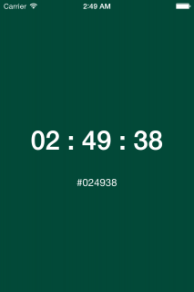

WhatColor?
==========

[][license]

[license]: https://github.com/to4iki/ghr/WhatColor/master/LICENSE

The digital timer by color scheme.

## Libraries
- [zwaldowski/BlocksKit](https://github.com/zwaldowski/BlocksKit)

## see also
[Jonic/WhatColourIsIt-ScreenSaver](https://github.com/Jonic/WhatColourIsIt-ScreenSaver)
